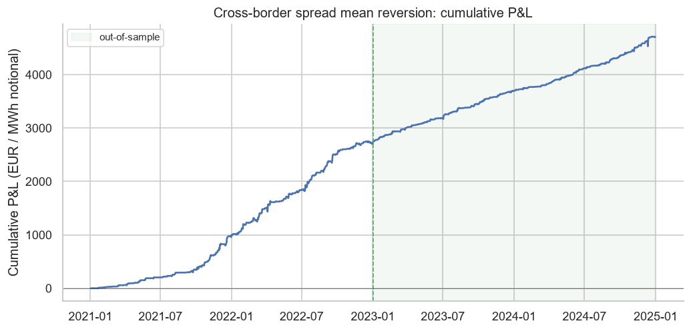
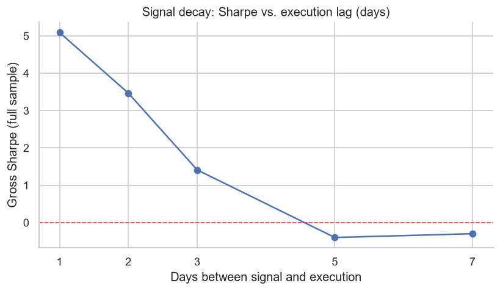
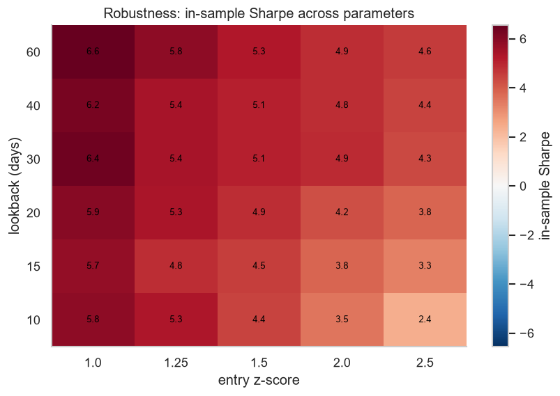
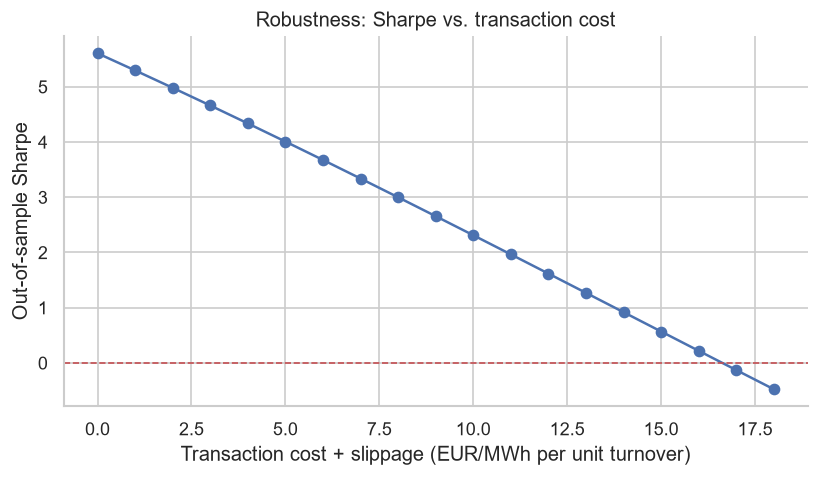
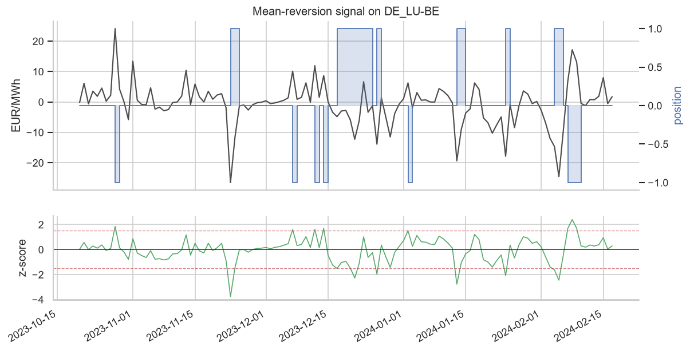
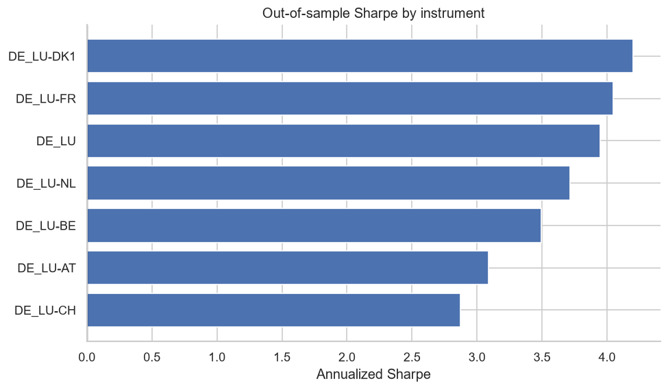

# Power Spread Trader

A backtesting framework for a mean-reversion strategy on European cross-border
day-ahead power spreads. The strategy itself is deliberately simple; the point
of the project is the evaluation around it, which is built to answer two
questions honestly: is the statistical edge real, and is it actually realizable
after the frictions a price-series backtest cannot see.

The short version: the strategy finds a strong, well-identified mean-reversion
signal that produces an out-of-sample Sharpe above 5 and survives transaction
costs up to about 17 EUR/MWh. It also explains, with evidence, why that Sharpe
is not a live trading edge. A backtest that prints a Sharpe of 5 and stops there
is usually hiding something; most of this repository is the work of finding out
what.

Data is real and free: hourly day-ahead prices for Germany and six neighbouring
zones from [SMARD.de](https://www.smard.de/en) (the Bundesnetzagentur's
platform), 2021–2024. No API key.

*Project developed May 2026.*

---

## Headline result

Seven instruments (the German price level plus six DE-vs-neighbour spreads) traded
as a daily, equal-weight, mean-reversion portfolio. The sample is split 50/50
into in-sample and out-of-sample, and all headline figures are out-of-sample and
net of a 0.50 EUR/MWh round-trip cost:

| Metric (out-of-sample, net of costs) | Value |
|---|--:|
| Annualized Sharpe | **5.45** |
| Sortino | 8.01 |
| Max drawdown | −101 EUR / MWh notional |
| Calmar | 9.9 |
| Hit rate | 62.5% |
| Break-even round-trip cost | **≈16.6 EUR/MWh** |



A Sharpe of 5 on a daily strategy should be treated as a warning, not a result.
Real funds operate at Sharpe 1 to 2. When a backtest prints 5, the useful
instinct is to look for the leak (lookahead, survivorship, an untradable
instrument) before trusting it. The signal here turns out to be genuine, but the
realizable edge is a smaller and more complicated thing.

There is a second point worth noting up front. Tripling the assumed cost from
the original 0.15 to 0.50 EUR/MWh barely moved the Sharpe, because break-even
sits near 17 EUR/MWh, far above any plausible execution cost. Cost is not what
limits this strategy.

---

## Is the signal real? Three checks

### 1. No lookahead: the signal decays with execution delay

If the apparent edge were an accounting leak, delaying execution would not remove
it. A genuine one-day mean reversion has to decay as you wait, and it does:

| Execution lag | Gross Sharpe |
|---|--:|
| 1 day | 5.09 |
| 2 days | 3.47 |
| 3 days | 1.41 |
| 5 days | −0.40 |



The value lives entirely in the next-day reversion, which is a known and fragile
property of power spreads.

### 2. Not cherry-picked: the whole parameter neighbourhood works

Every combination of lookback window and entry threshold is profitable
in-sample (Sharpe roughly 2.4 to 6.6). There is no single lucky cell; the result
is a broad plateau, which is what a real effect looks like and an overfit one
does not.



### 3. Not a backtest artifact: it dies on shuffled data

Shuffle each instrument's daily changes to destroy the time structure while
keeping the distribution, then re-run. The edge should vanish, and it does:
across 50 surrogates the out-of-sample Sharpe is −0.05 ± 0.62, against 5.45 on
the real data, a separation of about 8.9 standard deviations. The profit comes
from genuine autocorrelation, not from the machinery of the backtest.

---

## So why is this not a money printer?

The edge survives costs (break-even near 17 EUR/MWh, roughly twice the typical
daily spread move), so transaction costs are not the binding constraint.



What limits the realizable edge is tradability, the part a price-series backtest
cannot represent:

- **Cross-border spreads are not freely tradable.** Capturing a DE-AT spread
  requires cross-border transmission capacity, which is auctioned (FTRs and
  PTRs). Much of the spread's value is already priced into those rights rather
  than left available to a price-taker.
- **The instrument is a financial abstraction.** The backtest marks a daily
  position to consecutive day-ahead clearings, which is economically a spread
  swap or CfD. Those instruments exist but are far less liquid than the
  underlying and carry a wide bid-ask, and the day-ahead auction itself clears
  only once, so you cannot round-trip inside it.
- **Market impact at size.** The result assumes zero impact. Any meaningful
  volume moves these less-liquid spreads against you.
- **Persistence is itself evidence of friction.** A freely capturable Sharpe-5
  effect would not survive four years. That it persists is a sign the frictions
  above are real.

**Conclusion.** There is a real, robust mean-reversion signal in cross-border
day-ahead spreads. Turning it into P&L is a transmission-rights and liquidity
problem, not a signal problem, and a backtest that ignored that would be exactly
the overfit story this project is built to avoid.

---

## The strategy

**Instruments.** The reference-zone (DE/LU) daily-baseload price level, plus the
spread of DE/LU against each of FR, NL, BE, AT, CH and DK1. Each is traded as a
daily-settled financial position (a swap or CfD for the spreads).

**Signal.** For each instrument, z-score the level against a trailing window and
fade the deviation: short when the z-score is high, long when it is low, flat
near the mean. Entry and exit use a hysteresis band (`entry_z=1.5` above
`exit_z=0.5`) to avoid churning in and out.



**No lookahead.** The z-score on day *t* uses prices only up to day *t*, and the
resulting position earns the *t* to *t+1* move, enforced by a one-day shift in
the P&L accounting:

```
gross_pnl[t] = position[t-1] * (level[t] - level[t-1])
cost[t]      = |position[t] - position[t-1]| * (fees + slippage)
net_pnl[t]   = gross_pnl[t] - cost[t]
```

**Portfolio.** Equal weight across the seven instruments. Diversification across
imperfectly correlated spreads is what lifts the portfolio Sharpe above the
roughly 2.9 to 4.2 of any single instrument.



---

## Metrics reported

Sharpe, Sortino, max drawdown, Calmar, hit rate, turnover and annualized P&L,
all computed out-of-sample and net of modeled costs, with the gross (no-cost)
figure alongside so the cost impact is explicit. Everything is written to
`results/*.csv` for auditing.

---

## Running it

See [RUNNING.md](RUNNING.md) for full setup, including a VS Code walk-through.
The short version:

```bash
pip install -r requirements.txt
python scripts/run_all.py       # downloads data once, then runs the full analysis
```

Individual steps:

```bash
python scripts/download_prices.py
python scripts/run_backtest.py
python scripts/run_cost_sensitivity.py
python scripts/run_robustness.py
```

Tests:

```bash
pytest
```

---

## Repository layout

```
power-spread-trader/
├── config/strategy.yaml     # zones, signal params, costs, OOS split (no magic numbers in code)
├── src/spreadtrader/
│   ├── data/smard_prices.py # SMARD multi-zone day-ahead price client (cached)
│   ├── config.py            # typed config and validation
│   ├── signals.py           # instruments and z-score mean reversion (hysteresis, no lookahead)
│   ├── backtest.py          # engine: positions to P&L, costs, OOS split
│   ├── metrics.py           # Sharpe, Sortino, drawdown, Calmar, hit rate, turnover
│   └── plots.py             # charts
├── scripts/                 # download, backtest, cost sensitivity, robustness, run_all
├── tests/                   # no-lookahead, hysteresis, cost accounting, null and trend sanity
├── notebooks/               # exploratory scripts
└── results/                 # generated charts and metrics CSVs
```

---

## Data

| Field | Zones | Source |
|---|---|---|
| Day-ahead price (daily baseload) | DE/LU, FR, NL, BE, AT, CH, DK1 | EPEX SPOT / Nord Pool via SMARD |

- **SMARD.de** (Bundesnetzagentur), open data portal: <https://www.smard.de/en>
- Market data download centre and terms of use:
  <https://www.smard.de/en/downloadcenter/download-market-data/>
- Day-ahead prices are set by market coupling across
  [EPEX SPOT](https://www.epexspot.com/en) and
  [Nord Pool](https://www.nordpoolgroup.com) bidding zones.

Hourly prices are fetched in weekly chunks, cached to `data/raw`, and averaged to
a daily baseload product. Timestamps are parsed as UTC and converted to
Europe/Berlin so daylight-saving days are handled correctly.

---

## Assumptions and caveats

- **Price-taker, financial settlement.** Positions settle cash against the
  day-ahead clearing, with no transmission-rights modelling and no order book.
  This is the main reason the backtest Sharpe overstates the realizable edge, as
  discussed above.
- **Daily baseload.** Hourly prices are averaged to a daily baseload product to
  give a clean position strategy; hourly or intraday execution is an extension.
- **No market impact, constant per-unit costs, perfect fills.**
- The signal is intentionally simple. The contribution here is the honest
  evaluation, not signal sophistication.

## Possible extensions

- **Hourly or intraday execution** against continuous intraday prices, where a
  genuine day-ahead-to-intraday round-trip exists.
- **Transmission-rights-aware P&L**, netting the FTR/PTR auction cost against the
  spread capture to estimate the accessible edge.
- **Volatility-scaled position sizing** and a portfolio risk budget.
- **Walk-forward re-fitting** of the lookback and threshold rather than fixed
  parameters.

---

## Author

**Mohammad Faisal**, M.Sc. Power Engineering (Renewable Energy)

- GitHub: [github.com/CodingxFaisal](https://github.com/CodingxFaisal)
- Email: mohammad.faisal@gmx.de

## License

Released under the MIT License. See [LICENSE](LICENSE).

Data belongs to SMARD.de / Bundesnetzagentur and is used under their terms; see
the download-centre link above.
